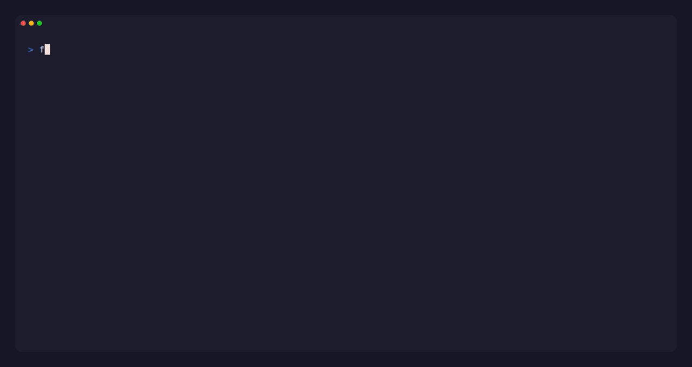

<div align="center">
  
  <h1>fleet-plan</h1>
  <p><strong><code>terraform plan</code>, but for <a href="https://fleetdm.com/">Fleet</a>.</strong></p>

  [](https://codecov.io/gh/TsekNet/fleet-plan)
  [](https://opensource.org/licenses/MIT)
  [](https://github.com/TsekNet/fleet-plan/releases)
</div>

---

Shows what will change in your Fleet environment before you apply. Compares fleet-gitops YAML against the live Fleet API. Read-only (GET only).

Run in CI **before** `fleetctl gitops --dry-run`. fleet-plan shows *what* changes. fleetctl validates *whether it's valid*.



> **Disclaimer:** This was created as a fun side project, not affiliated with any company.

## Install

Grab a binary from [Releases](https://github.com/TsekNet/fleet-plan/releases) or install via Go:

```bash
go install github.com/TsekNet/fleet-plan/cmd/fleet-plan@latest
```
## Quick start

```bash
# All teams
fleet-plan

# Single team
fleet-plan --team Workstations

# Pre-merged default.yml from CI
fleet-plan --default /tmp/default.yml

# JSON or Markdown output
fleet-plan --format json
fleet-plan --format markdown
```

## What it diffs

| Scope | Resources |
|-------|-----------|
| Team (`teams/*.yml`) | Policies, queries, software, MDM profiles |
| Global (`default.yml`) | org_settings, agent_options, controls, global policies/queries, labels |

Use `fleetctl gitops --dry-run` for secret substitution, server-side validation, environment merging.

## Auth

```bash
# Env vars (CI)
export FLEET_PLAN_URL=https://fleet.example.com
export FLEET_PLAN_TOKEN=your-token

# Or flags
fleet-plan --url https://fleet.example.com --token your-token
```

...or a config file (~/.config/fleet-plan.json):

```json
{
  "contexts": {
    "dev": {
      "url": "https://dev.fleet.example.com",
      "token": "..."
    }
  },
  "default_context": "dev"
}
```

## CI integration

```bash
# Show what will change
fleet-plan

# Validate server-side
fleetctl gitops -f default.yml --dry-run
```

## Docs

- **[Architecture](docs/architecture.md)** -- data flow, packages, diff matching keys
- **[API endpoints](docs/api-endpoints.md)** -- every GET endpoint fleet-plan calls

## Contributing

```bash
git clone https://github.com/TsekNet/fleet-plan.git && cd fleet-plan
go test -race ./...
```

## License

[MIT](LICENSE)
