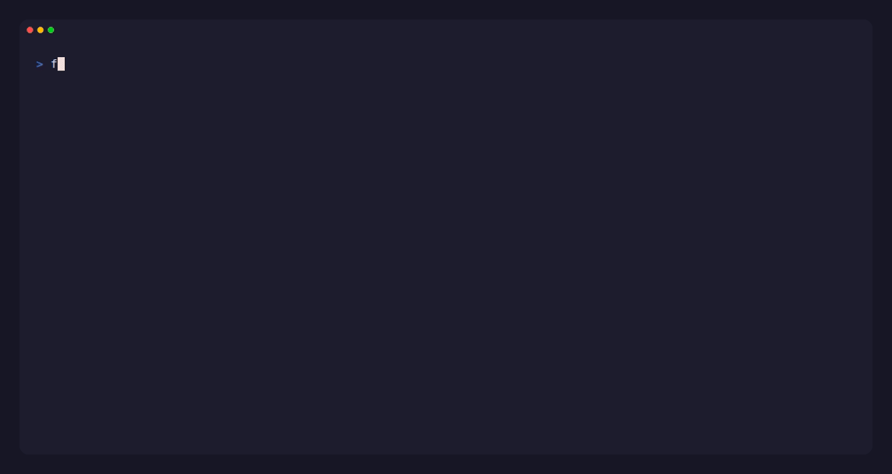

<div align="center">
  
  <h1>fleet-plan</h1>
  <p><strong><code>terraform plan</code>, but for <a href="https://fleetdm.com/">Fleet</a>.</strong></p>

  [](https://codecov.io/gh/TsekNet/fleet-plan)
  [](https://opensource.org/licenses/MIT)
  [](https://github.com/TsekNet/fleet-plan/releases)
</div>

---

Shows what will change in your Fleet environment before you apply. Compares fleet-gitops YAML against the live Fleet API. Read-only (GET only).

Run in CI **before** `fleetctl gitops --dry-run`. fleet-plan shows *what* changes. fleetctl validates *whether it's valid*.



> **Disclaimer:** This was created as a fun side project, not affiliated with any company.

## Features

| Feature | Description |
|---|---|
| Semantic diff | Compares YAML against live Fleet state per-field, not line-by-line |
| Team-scoped | Diff one team, multiple teams, or all teams at once |
| CI integration | `--git` auto-detects GitLab/GitHub, resolves changed files, posts MR/PR comment |
| Multi-env merge | `--base` + `--env` merges config overlays in-memory (no `yq` needed) |
| Script diffing | Line-count diffs for team scripts (+N/-N) |
| Label validation | Cross-references labels against Fleet, shows host counts |
| Multiple formats | Terminal (colored), JSON, Markdown |
| Read-only | GET requests only, never mutates Fleet |

## Install

Grab a binary from [Releases](https://github.com/TsekNet/fleet-plan/releases).

## Quick start

```bash
# All teams
fleet-plan

# Single team
fleet-plan --team Workstations

# CI mode: auto-detect changed files, diff affected teams, post MR comment
fleet-plan --git --base base.yml --env environments/prod.yml --format markdown
```

## Usage

### Subcommands

| Subcommand | Details | Example |
|---|---|---|
| *(default)* | Diff proposed YAML against live Fleet state | `fleet-plan` |
| `version` | Print version, build date, Go version, OS/arch | `fleet-plan version` |

### Flags

| Flag | Details | Example |
|---|---|---|
| `--url` | Fleet server URL (or `$FLEET_URL`) | `--url https://fleet.example.com` |
| `--token` | API token (or `$FLEET_TOKEN`) | `--token fleetctl-abc123` |
| `--repo` | Path to fleet-gitops repo (default: `.`) | `--repo /opt/fleet-gitops` |
| `--team` | Diff only these teams (repeatable) | `--team Workstations --team Servers` |
| `-f`, `--format` | Output format: `terminal`, `json`, `markdown` | `-f markdown` |
| `--no-color` | Disable color output | `--no-color` |
| `-v`, `--verbose` | Show full old/new values for modified fields | `-v` |
| `--heading` | Custom heading for markdown output | `--heading "Staging diff"` |
| `--detailed-exitcodes` | Exit 2 when changes detected (0=none, 1=error) | `--detailed-exitcodes` |
| `--git` | CI mode: auto-detect platform, resolve changed files, infer teams, post MR/PR comment | `--git` |
| `--base` | Path to base.yml for multi-env config merge (requires `--env`) | `--base base.yml` |
| `--env` | Path to environment overlay YAML, merged with `--base` in-memory | `--env environments/prod.yml` |

### What it diffs

| Scope | Resources |
|---|---|
| Team (`teams/*.yml`) | Policies, queries, software, MDM profiles, scripts |
| Global (`default.yml`) | org_settings, agent_options, controls, global policies/queries, labels |

Use `fleetctl gitops --dry-run` for secret substitution, server-side validation, environment merging.

## Configuration

### Auth

Set via flags, environment variables, or a config file (`~/.config/fleet-plan.json`):

```bash
# Env vars (CI)
export FLEET_URL=https://fleet.example.com
export FLEET_TOKEN=your-token

# Or flags
fleet-plan --url https://fleet.example.com --token your-token
```

```json
{
  "contexts": {
    "dev": {
      "url": "https://dev.fleet.example.com",
      "token": "..."
    }
  },
  "default_context": "dev"
}
```

### CI integration

Use `--git` to auto-detect the CI platform (GitHub Actions or GitLab CI), resolve changed files from the MR/PR, infer affected teams, and post a diff comment:

```bash
fleet-plan \
  --git \
  --base base.yml \
  --env environments/prod.yml \
  --format markdown \
  --detailed-exitcodes
```

When `--git` is active, fleet-plan:
1. Detects the CI platform from environment variables
2. Fetches the list of changed files from the MR/PR API (falls back to `git diff`)
3. Resolves which teams reference those files
4. Diffs only the affected teams and global config
5. Posts (or updates) a comment on the MR/PR with the diff

| Env var | Used for |
|---|---|
| `FLEET_URL` / `FLEET_TOKEN` | Fleet API auth |
| `FLEET_PLAN_BOT` | GitLab: token for posting MR comments |
| `GITHUB_TOKEN` | GitHub: token for posting PR comments |
| `CI_JOB_URL` / `GITHUB_SERVER_URL` + `GITHUB_REPOSITORY` + `GITHUB_RUN_ID` | Link back to the pipeline job in the comment |
| `PR_NUMBER` / `GITHUB_PR_NUMBER` / `GITHUB_EVENT_PATH` | PR number detection (fallback order: explicit env vars, then event payload JSON) |

## Documentation

- [Architecture](docs/Architecture.md) - data flow, packages, diff matching keys
- [API Endpoints](docs/API-Endpoints.md) - every GET endpoint fleet-plan calls

## Known Limitations

- **GitOps API token cannot read software or profiles.** The `gitops` role returns HTTP 403 on `/software/titles` and `/mdm/profiles`. `fleet-plan` handles this gracefully by skipping those resources, but the diff will not include software or profile changes. Tracked upstream: [fleetdm/fleet#38044](https://github.com/fleetdm/fleet/issues/38044).

## Contributing

```bash
git clone https://github.com/TsekNet/fleet-plan.git && cd fleet-plan
go test -race ./...
```

## License

[MIT](LICENSE)
