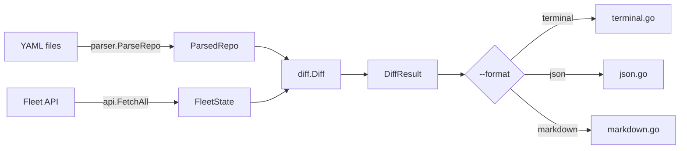

# Architecture

Single-binary Go CLI. Parses fleet-gitops YAML, fetches current state from Fleet API (GET only), computes semantic diff, renders output.

## Layout

```
cmd/fleet-plan/        Cobra commands (main.go, diff.go, version.go)
internal/
  api/client.go        Read-only Fleet REST client
  config/config.go     Auth resolution (flags > env > config file)
  parser/parser.go     YAML parser for fleet-gitops repos
  diff/differ.go       Semantic diff engine
  output/              Renderers: terminal, json, markdown
  testutil/            Shared test helpers
testdata/              Realistic fleet-gitops fixture for tests
```

## Data flow



## API client

`FetchAll` parallelizes all GET requests via `errgroup`. When `default.yml` has global sections, it also fetches `/config`, global policies, and global queries.

See [api-endpoints.md](api-endpoints.md) for the full list.

## Parser

Walks `teams/*.yml`, resolves `path:` references, produces `ParsedRepo`. Also parses `default.yml` for labels, `org_settings`, `agent_options`, `controls`, and global policies/queries.

## Diff engine

Compares `FleetState` (API) vs `ParsedRepo` (YAML). Produces `[]DiffResult` per team + a `(global)` result when `default.yml` is present.

| Resource | Match key | Diff fields |
|----------|-----------|-------------|
| Config sections | dot-path key | old/new value (skips `$VAR` placeholders) |
| Policies | `name` | query, description, resolution, platform, critical |
| Queries | `name` | query, interval, platform, logging |
| Software packages | `referenced_yaml_path` | url, hash, self_service |
| Fleet-maintained apps | `slug` | self_service |
| App Store apps | `app_store_id` | self_service |
| Profiles | PayloadDisplayName | add/delete only |
| Labels | `name` (cross-ref) | valid/missing with host counts |

Whitespace is normalized before comparison to avoid false positives from YAML vs API newline differences.

## Tests

```
go test -race ./...
```

All packages have `_test.go`. Tests use `testdata/` as a shared fleet-gitops fixture. Table-driven throughout.
