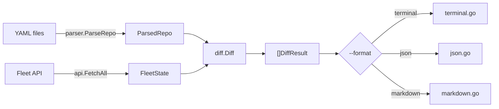

# Architecture

Single-binary Go CLI. Parses fleet-gitops YAML, fetches current state from Fleet API (GET only), computes semantic diff, renders output.

## Layout

```
cmd/fleet-plan/
  main.go               Cobra root command, flag wiring, runDiff entrypoint
  version.go            Version subcommand (set via ldflags)
  cmd_test.go           CLI flag and command tests
internal/
  api/client.go         Read-only Fleet REST client (GET only, HTTPS enforced)
  config/config.go      Auth resolution: flags > env vars > config file
  parser/parser.go      YAML parser for fleet-gitops repos (path traversal protected)
  diff/differ.go        Semantic diff engine with per-field change tracking
  output/
    terminal.go         ANSI-colored terminal renderer (truncation, diff context)
    json.go             JSON renderer
    markdown.go         Markdown renderer
    gen_screenshot.go   Screenshot generator (//go:build ignore)
  testutil/             Shared test helpers (TestdataRoot)
testdata/               Realistic fleet-gitops fixture repo for tests
assets/                 Logo and screenshot images
docs/                   Architecture and API endpoint docs
```

## Data flow



## API client

`FetchAll` parallelizes all GET requests via `errgroup`. When `default.yml` has global sections, it also fetches `/config`, global policies, and global queries. HTTPS is enforced by default (`FLEET_PLAN_INSECURE=1` to override for local dev).

See [api-endpoints.md](api-endpoints.md) for the full list.

## Auth resolution

Priority order (highest wins):

1. `--url` / `--token` flags
2. `FLEET_PLAN_URL` / `FLEET_PLAN_TOKEN` env vars
3. Config file: `~/.config/fleet-plan.json` or `<repo>/.config/fleet-plan.json`

Config file supports multiple contexts:

```json
{
  "contexts": { "dev": { "url": "...", "token": "..." } },
  "default_context": "dev"
}
```

## Parser

Walks `teams/*.yml`, resolves `path:` references, produces `ParsedRepo`. Also parses `default.yml` for labels, `org_settings`, `agent_options`, `controls`, and global policies/queries. All path references are validated against the repo root to prevent traversal.

## Diff engine

Compares `FleetState` (API) vs `ParsedRepo` (YAML). Produces `[]DiffResult` per team + a `(global)` result when `default.yml` is present.

| Resource | Match key | Diff fields |
|----------|-----------|-------------|
| Config sections | dot-path key | old/new value (skips `$VAR` placeholders) |
| Policies | `name` | query, description, resolution, platform, critical |
| Queries | `name` | query, interval, platform, logging |
| Software packages | `referenced_yaml_path` | url, hash, self_service |
| Fleet-maintained apps | `slug` | self_service |
| App Store apps | `app_store_id` | self_service |
| Profiles | PayloadDisplayName | add/delete only |
| Labels | `name` (cross-ref) | valid/missing with host counts |

Whitespace is normalized before comparison to avoid false positives from YAML vs API newline differences. Per-field diffs are stored in `ResourceChange.Fields` for both added and modified resources.

## Output modes

| Mode | Flag | Description |
|------|------|-------------|
| Terminal (default) | `--format terminal` | ANSI-colored, smart truncation (80 chars), diff context around changes, capped at 3 fields per resource |
| Terminal verbose | `--verbose` | Full untruncated old/new values for all changed fields |
| JSON | `--format json` | Machine-readable, all fields |
| Markdown | `--format markdown` | For CI comments / MR descriptions |

## Screenshot generation

`gen_screenshot.go` (`//go:build ignore`) renders representative output from testdata fixtures for the README screenshot. Regenerate with:

```bash
go run ./internal/output/gen_screenshot.go > /tmp/raw.txt
termshot --raw-read /tmp/raw.txt -f assets/screenshot.png -C 100
```

Requires a PTY wrapper (e.g., `script -qec`) for ANSI color output when piping.

## Tests

```
go test -race ./...
```

All packages have `_test.go`. Tests use `testdata/` as a shared fleet-gitops fixture. Table-driven throughout. Coverage target: >= 75% (current: ~81%).
